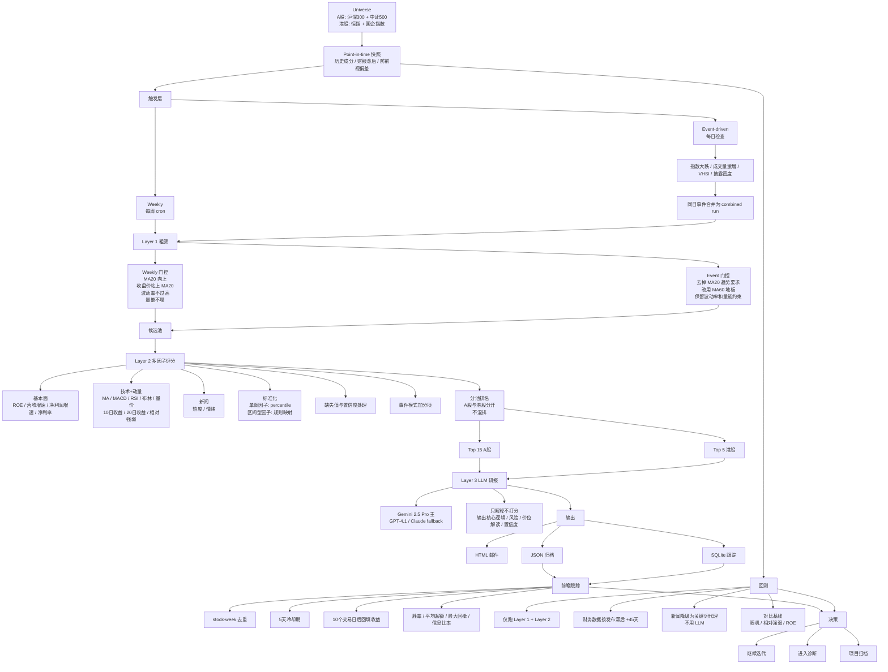
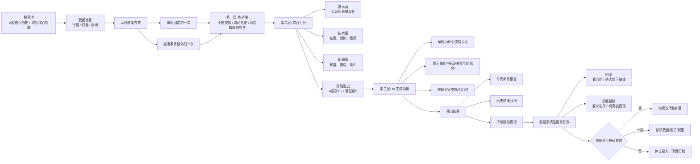

# Stock Screener

A-share + HK stock screening tool with multi-layer funnel, multi-factor scoring, LLM-assisted reports, and built-in validation framework.

## Architecture



## Overview



## System Diagram (Text)

```
+----------------------------------------------------------------------------------+
|                             STOCK SCREENER SYSTEM                                |
+----------------------------------------------------------------------------------+

  [Universe]
    A股: 沪深300 + 中证500
    港股: 恒指 + 国企指数
          |
          v
  [Point-in-Time 快照层]
    - 历史成分快照
    - 财报发布滞后 +45天
    - 防前视偏差
          |
          v
  [触发层]
    +----------------------+----------------------+
    | Weekly               | Event-driven         |
    | 每周 cron            | 每日收盘后检查       |
    +----------------------+----------------------+
                               |
                               v
                        [事件触发器]
                        - 指数大跌
                        - 成交量激增
                        - VHSI 飙升
                        - 披露密度阈值
                               |
                               v
                        [同日多触发合并]
                        combined run / run_id

          |
          v
  [Layer 1 粗筛]
    +--------------------------------------------------------------+
    | Weekly 门控                                                  |
    | - MA20 向上                                                  |
    | - 收盘价 > MA20                                              |
    | - 波动率不过高                                               |
    | - 量能不塌                                                   |
    +--------------------------------------------------------------+
    | Event 门控                                                   |
    | - 去掉 MA20 趋势要求                                        |
    | - 改用 MA60 地板                                             |
    | - 波动率不过高                                               |
    | - 量能检查                                                   |
    +--------------------------------------------------------------+
          |
          v
  [候选池]
    约 200-400 只
          |
          v
  [Layer 2 多因子评分]
    1) 基本面
       - ROE
       - 营收增速
       - 净利润增速
       - 净利率

    2) 技术 + 动量
       - MA 排列
       - MACD
       - RSI
       - 布林带位置
       - 量价配合
       - 10日收益
       - 20日收益
       - 相对强弱

    3) 新闻
       - 热度
       - 情绪

    标准化:
       - 单调因子 -> percentile rank
       - 区间最优因子 -> 规则映射函数

    其它规则:
       - 缺失值重算权重
       - 低覆盖 -> 低置信度
       - 事件模式可加 bonus
          |
          v
  [分池排名]
    - A股单独排名
    - 港股单独排名
    - 不混排
          |
          v
  [Top N]
    - A股 Top 15
    - 港股 Top 5
          |
          v
  [Layer 3 LLM 研报]
    输入:
      - 三维得分
      - 因子值
      - 新闻标题
      - 规则计算价位
    模型链:
      Gemini 2.5 Pro
         -> GPT-4.1
         -> Claude
    输出:
      - 核心逻辑
      - 主要风险
      - 价位解读
      - 置信度
    注:
      LLM 只解释, 不参与打分
          |
          v
  [输出层]
    +-------------------+-------------------+----------------------+
    | HTML 邮件         | JSON 归档         | SQLite 跟踪          |
    | 周报 / 事件报告   | results/{run_id}  | recommendations      |
    | 迷你K线图         |                   | outcomes             |
    | 市场概览          |                   | run_summary          |
    +-------------------+-------------------+----------------------+
                                                   |
                                                   v
  [前瞻跟踪]
    - stock-week 去重
    - 5天冷却期
    - 10个交易日后回填收益
    - 标签: WIN / DRAW / LOSE
    - 指标:
      胜率 / 平均超额 / 最大回撤 / 信息比率
                                                   |
                                                   v
  [决策]
    - 继续迭代
    - 进入诊断
    - 项目归档


+----------------------------------------------------------------------------------+
|                                   BACKTEST                                       |
+----------------------------------------------------------------------------------+

  [历史 Universe 快照]
          +
  [Point-in-Time 财务]
          +
  [历史新闻代理(关键词, 不用 LLM)]
          |
          v
  [只运行 Layer 1 + Layer 2]
          |
          v
  [和基线对比]
    - 随机选股 20 只
    - 按相对强弱选 Top 20
    - 按 ROE 选 Top 20
          |
          v
  [评估]
    - 3个月: 验证管线跑通
    - 6-12个月: 初步判断信号质量
          |
          v
  [若持续跑不赢简单基线 -> 诊断 / 归档]
```

## Key Design Decisions

- **Independent repo** — no symlink/dependency on stock-monitor; lean data layer copied and slimmed down
- **A-share and HK ranked separately** — different liquidity, data sources, and trading accounts
- **Dual trigger mode** — weekly scheduled + event-driven (with separate Layer 1 gates per mode)
- **LLM explains, not scores** — Layer 3 generates reports but does not influence ranking
- **Point-in-time backtest** — fundamentals use +45d publication lag, news degrades to keyword proxy
- **Built-in stop conditions** — 12-period diagnosis gate, 24-period archive gate

## Tech Stack

- Python 3.12, `~/stock-env/` venv
- Data: East Money push2 + akshare + Longbridge CLI (HK) + Tencent (fallback)
- Technical analysis: pandas-ta
- LLM: GPT-4.1-mini (sentiment batch) + Gemini 2.5 Pro (reports) with fallback chain
- Storage: JSONL + SQLite
- Output: HTML email (MVP), Web UI (post-validation)

## Status

**Phase 0: DONE** (2026-04-17 full run, 885 stocks, all 6 §C criteria met). Next stage = "Layer 1 Weekly" (= M0 productionize + M1 Layer 1). Layer 1 design §0 (strategy posture) + §1 scope + §2 architecture v5 + §3 four Layer 1 rules v2 all frozen 2026-04-18; §4 (sector tagging + HK fallback) + §5 (error handling + resume) WIP.

**Strategy posture**: current Layer 1 4-rule set is right-side trend confirmation by design. User's true preference tilts left-side dislocation — deferred as M1.5 channel, merged in Layer 2 via `entry_pathway` tag.

### Design artifacts

- [Design spec](docs/superpowers/specs/2026-04-14-stock-screener-design.md) — ~800 lines, 5-round review, 6 findings fixed
- [Layer 1 Weekly design](docs/superpowers/specs/2026-04-18-layer1-weekly-design.md) — §0-§3 frozen, §4-§5 WIP
- [Phase 0 spike plan v3](docs/superpowers/plans/2026-04-15-phase0-data-spike.md) — §A–§I frozen, full run completed
- [Phase 0 infra plan](docs/superpowers/plans/2026-04-15-phase0-data-infra.md) — **SUPERSEDED**, do not reference for implementation

### Phase 0 scope

- **Universe**: CSI 300 + CSI 500 (A-share, ~800) + HSI + HSCEI (HK, ~100 provisional seed)
- **Data**: OHLCV via Longbridge CLI + fundamentals via East Money push2 — 8 canonical fields per §I (`roe_ttm`, `revenue_growth`, `net_profit_growth`, `net_margin_ttm`, `gross_margin`, `pe_ttm`, `pb`, `market_cap`); HK has known gaps on `revenue_growth` / `net_margin_ttm` / `gross_margin`
- **Output**: `artifacts/phase0/` (production `data/` reserved for Phase 1+)
- **Dry-run**: 15 frozen samples (10 A-share + 5 HK), verified against live index membership 2026-04-16
- **Exit criteria**: classifiable + reproducible + recoverable failures, NOT coverage %
