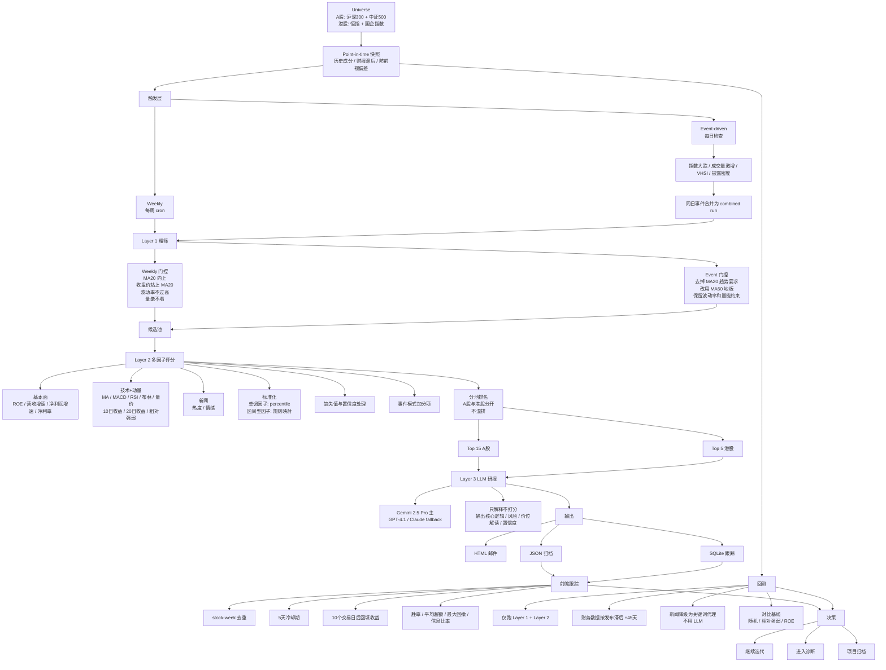
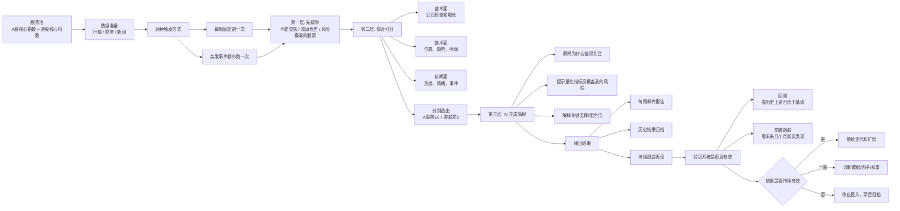

# Stock Screener

A-share + HK stock screening tool with multi-layer funnel, multi-factor scoring, LLM-assisted reports, and built-in validation framework.

## Architecture

## Overview

## Key Design Decisions

- **Independent repo** — no symlink/dependency on stock-monitor; lean data layer copied and slimmed down
- **A-share and HK ranked separately** — different liquidity, data sources, and trading accounts
- **Dual trigger mode** — weekly scheduled + event-driven (with separate Layer 1 gates per mode)
- **LLM explains, not scores** — Layer 3 generates reports but does not influence ranking
- **Point-in-time backtest** — fundamentals use +45d publication lag, news degrades to keyword proxy
- **Built-in stop conditions** — 12-period diagnosis gate, 24-period archive gate

## Tech Stack

- Python 3.12, `~/stock-env/` venv
- Data: East Money push2 + akshare + Longbridge CLI (HK) + Tencent (fallback)
- Technical analysis: pandas-ta
- LLM: GPT-4.1-mini (sentiment batch) + Gemini 2.5 Pro (reports) with fallback chain
- Storage: JSONL + SQLite
- Output: HTML email (MVP), Web UI (post-validation)

## Status

- Design spec: `docs/superpowers/specs/2026-04-14-stock-screener-design.md`
- Phase: design complete, implementation planning next
