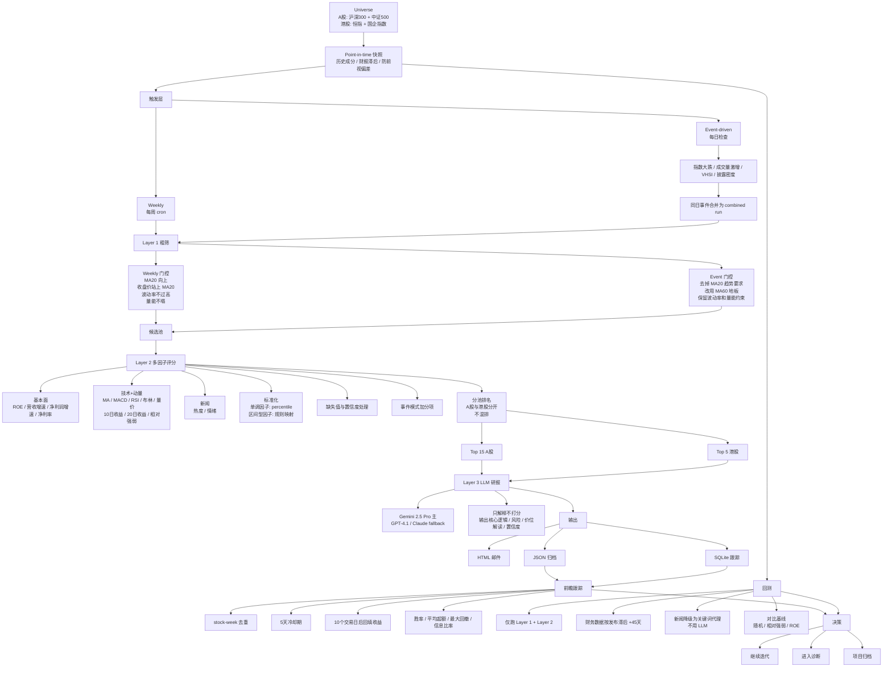
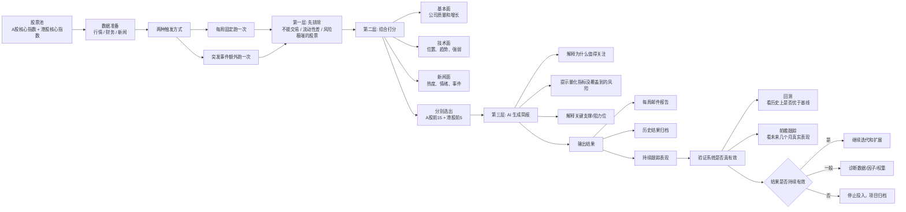

# Stock Screener

A-share + HK stock screening tool with multi-layer funnel, multi-factor scoring, LLM-assisted reports, and built-in validation framework.

## Architecture


```mermaid
flowchart TD
    A[Universe\nA股: 沪深300 + 中证500\n港股: 恒指 + 国企指数] --> B[Point-in-time 快照\n历史成分 / 财报滞后 / 防前视偏差]

    B --> C[触发层]
    C --> C1[Weekly\n每周 cron]
    C --> C2[Event-driven\n每日检查]
    C2 --> C3[指数大跌 / 成交量激增 / VHSI / 披露密度]
    C3 --> C4[同日事件合并为 combined run]

    C1 --> D[Layer 1 粗筛]
    C4 --> D

    D --> D1[Weekly 门控\nMA20 向上\n收盘价站上 MA20\n波动率不过高\n量能不塌]
    D --> D2[Event 门控\n去掉 MA20 趋势要求\n改用 MA60 地板\n保留波动率和量能约束]
    D1 --> E[候选池]
    D2 --> E[候选池]

    E --> F[Layer 2 多因子评分]
    F --> F1[基本面\nROE / 营收增速 / 净利润增速 / 净利率]
    F --> F2[技术+动量\nMA / MACD / RSI / 布林 / 量价\n10日收益 / 20日收益 / 相对强弱]
    F --> F3[新闻\n热度 / 情绪]
    F --> F4[标准化\n单调因子: percentile\n区间型因子: 规则映射]
    F --> F5[缺失值与置信度处理]
    F --> F6[事件模式加分项]

    F --> G[分池排名\nA股与港股分开\n不混排]
    G --> G1[Top 15 A股]
    G --> G2[Top 5 港股]

    G1 --> H[Layer 3 LLM 研报]
    G2 --> H
    H --> H1[Gemini 2.5 Pro 主\nGPT-4.1 / Claude fallback]
    H --> H2[只解释不打分\n输出核心逻辑 / 风险 / 价位解读 / 置信度]

    H --> I[输出]
    I --> I1[HTML 邮件]
    I --> I2[JSON 归档]
    I --> I3[SQLite 跟踪]

    I2 --> J[前瞻跟踪]
    I3 --> J
    J --> J1[stock-week 去重]
    J --> J2[5天冷却期]
    J --> J3[10个交易日后回填收益]
    J --> J4[胜率 / 平均超额 / 最大回撤 / 信息比率]

    B --> K[回测]
    K --> K1[仅跑 Layer 1 + Layer 2]
    K --> K2[财务数据按发布滞后 +45天]
    K --> K3[新闻降级为关键词代理\n不用 LLM]
    K --> K4[对比基线\n随机 / 相对强弱 / ROE]

    J --> L[决策]
    K --> L
    L --> L1[继续迭代]
    L --> L2[进入诊断]
    L --> L3[项目归档]
```

## Overview


```mermaid
flowchart LR
    A[股票池\nA股核心指数 + 港股核心指数] --> B[数据准备\n行情 / 财务 / 新闻]
    B --> C[两种触发方式]
    C --> C1[每周固定跑一次]
    C --> C2[突发事件额外跑一次]

    C1 --> D[第一层: 先排除\n不能交易 / 流动性差 / 风险极端的股票]
    C2 --> D

    D --> E[第二层: 综合打分]
    E --> E1[基本面\n公司质量和增长]
    E --> E2[技术面\n位置、趋势、强弱]
    E --> E3[新闻面\n热度、情绪、事件]

    E --> F[分别选出\nA股前15 + 港股前5]
    F --> G[第三层: AI 生成简报]
    G --> G1[解释为什么值得关注]
    G --> G2[提示量化指标没覆盖到的风险]
    G --> G3[解释关键支撑/阻力位]

    G --> H[输出结果]
    H --> H1[每周邮件报告]
    H --> H2[历史结果归档]
    H --> H3[持续跟踪表现]

    H3 --> I[验证系统是否真有效]
    I --> I1[回测\n看历史上是否优于基线]
    I --> I2[前瞻跟踪\n看未来几个月真实表现]

    I --> J{结果是否持续有效}
    J -->|是| K[继续迭代和扩展]
    J -->|一般| L[诊断数据/因子/权重]
    J -->|否| M[停止投入，项目归档]
```

## System Diagram (Text)

```
+----------------------------------------------------------------------------------+
|                             STOCK SCREENER SYSTEM                                |
+----------------------------------------------------------------------------------+

  [Universe]
    A股: 沪深300 + 中证500
    港股: 恒指 + 国企指数
          |
          v
  [Point-in-Time 快照层]
    - 历史成分快照
    - 财报发布滞后 +45天
    - 防前视偏差
          |
          v
  [触发层]
    +----------------------+----------------------+
    | Weekly               | Event-driven         |
    | 每周 cron            | 每日收盘后检查       |
    +----------------------+----------------------+
                               |
                               v
                        [事件触发器]
                        - 指数大跌
                        - 成交量激增
                        - VHSI 飙升
                        - 披露密度阈值
                               |
                               v
                        [同日多触发合并]
                        combined run / run_id

          |
          v
  [Layer 1 粗筛]
    +--------------------------------------------------------------+
    | Weekly 门控                                                  |
    | - MA20 向上                                                  |
    | - 收盘价 > MA20                                              |
    | - 波动率不过高                                               |
    | - 量能不塌                                                   |
    +--------------------------------------------------------------+
    | Event 门控                                                   |
    | - 去掉 MA20 趋势要求                                        |
    | - 改用 MA60 地板                                             |
    | - 波动率不过高                                               |
    | - 量能检查                                                   |
    +--------------------------------------------------------------+
          |
          v
  [候选池]
    约 200-400 只
          |
          v
  [Layer 2 多因子评分]
    1) 基本面
       - ROE
       - 营收增速
       - 净利润增速
       - 净利率

    2) 技术 + 动量
       - MA 排列
       - MACD
       - RSI
       - 布林带位置
       - 量价配合
       - 10日收益
       - 20日收益
       - 相对强弱

    3) 新闻
       - 热度
       - 情绪

    标准化:
       - 单调因子 -> percentile rank
       - 区间最优因子 -> 规则映射函数

    其它规则:
       - 缺失值重算权重
       - 低覆盖 -> 低置信度
       - 事件模式可加 bonus
          |
          v
  [分池排名]
    - A股单独排名
    - 港股单独排名
    - 不混排
          |
          v
  [Top N]
    - A股 Top 15
    - 港股 Top 5
          |
          v
  [Layer 3 LLM 研报]
    输入:
      - 三维得分
      - 因子值
      - 新闻标题
      - 规则计算价位
    模型链:
      Gemini 2.5 Pro
         -> GPT-4.1
         -> Claude
    输出:
      - 核心逻辑
      - 主要风险
      - 价位解读
      - 置信度
    注:
      LLM 只解释, 不参与打分
          |
          v
  [输出层]
    +-------------------+-------------------+----------------------+
    | HTML 邮件         | JSON 归档         | SQLite 跟踪          |
    | 周报 / 事件报告   | results/{run_id}  | recommendations      |
    | 迷你K线图         |                   | outcomes             |
    | 市场概览          |                   | run_summary          |
    +-------------------+-------------------+----------------------+
                                                   |
                                                   v
  [前瞻跟踪]
    - stock-week 去重
    - 5天冷却期
    - 10个交易日后回填收益
    - 标签: WIN / DRAW / LOSE
    - 指标:
      胜率 / 平均超额 / 最大回撤 / 信息比率
                                                   |
                                                   v
  [决策]
    - 继续迭代
    - 进入诊断
    - 项目归档


+----------------------------------------------------------------------------------+
|                                   BACKTEST                                       |
+----------------------------------------------------------------------------------+

  [历史 Universe 快照]
          +
  [Point-in-Time 财务]
          +
  [历史新闻代理(关键词, 不用 LLM)]
          |
          v
  [只运行 Layer 1 + Layer 2]
          |
          v
  [和基线对比]
    - 随机选股 20 只
    - 按相对强弱选 Top 20
    - 按 ROE 选 Top 20
          |
          v
  [评估]
    - 3个月: 验证管线跑通
    - 6-12个月: 初步判断信号质量
          |
          v
  [若持续跑不赢简单基线 -> 诊断 / 归档]
```

## Key Design Decisions

- **Independent repo** — no symlink/dependency on stock-monitor; lean data layer copied and slimmed down
- **A-share and HK ranked separately** — different liquidity, data sources, and trading accounts
- **Dual trigger mode** — weekly scheduled + event-driven (with separate Layer 1 gates per mode)
- **LLM explains, not scores** — Layer 3 generates reports but does not influence ranking
- **Point-in-time backtest** — fundamentals use +45d publication lag, news degrades to keyword proxy
- **Built-in stop conditions** — 12-period diagnosis gate, 24-period archive gate

## Tech Stack

- Python 3.12, `~/stock-env/` venv
- Data: East Money push2delay + akshare + Longbridge CLI (HK) + Tencent (fallback)
  - **Note (2026-06-03)**: push2 overseas edge nodes return 502 for this EC2 since 2026-06-02 (domestic access unaffected; push2delay serves byte-identical fields and is NOT blocked). Research snapshots use Tencent qt primary + push2delay fallback (`5c7167e`); Phase 0 fundamentals fetcher (`phase0_spike.py`) migrated push2 → push2delay.
- Technical analysis: pandas-ta
- LLM: GPT-4.1-mini (sentiment batch) + Gemini 2.5 Pro (reports) with fallback chain
- Storage: JSONL + SQLite
- Output: HTML email (MVP), Web UI (post-validation)

## Status

**Phase 0: DONE** (2026-04-17 full run, 885 stocks, all 6 §C criteria met). Next stage = "Layer 1 Weekly" (= M0 productionize + M1 Layer 1). Layer 1 design §0 (strategy posture) + §1 scope + §2 architecture v5 + §3 four Layer 1 rules v2 all frozen 2026-04-18; §4 (sector tagging + HK fallback) + §5 (error handling + resume) WIP.

**Strategy posture**: current Layer 1 4-rule set is right-side trend confirmation by design. User's true preference tilts left-side dislocation — deferred as M1.5 channel, merged in Layer 2 via `entry_pathway` tag.

**Daily API canary** (since 2026-04-25): `scripts/canary_check.sh` runs 10:00 BJT (`0 2 * * *` UTC) via `~/cron-wrapper.sh`, executes `phase0_spike.py --limit 15 --workers 1`, writes to `artifacts/canary-latest/`. Pass = universe == 15 + ohlcv ≥ 14 + fundamentals ≥ 14. Failure → email alert (threshold-check exit propagation fixed 2026-07-06, `aebb574` — a FAIL between 928026c and the fix exited 0 silently). Verifies akshare / Longbridge / East Money all healthy without daily-running the 74-min full pipeline. Will be re-evaluated once Layer 1 Weekly cron lands. **Fundamentals fetch retry (2026-07-13, `bdd26cc`)**: `fetch_fundamentals_one` hit transient push2delay 15s timeouts on 1-3/15 symbols three times in one week (7-05/7-08/7-13, each confirmed transient by manual replay) — added 2 retries with 2s/5s backoff on network-transient errors only. **CSI universe fetch retry (2026-07-20, `371eb5d`)**: `_fetch_csi_universe` (Step 1) died when the csindex.com.cn constituent API hung >30s — extracted `_fetch_csi_once` (30s fail-fast) and wrapped it in a retry loop (`CSI_RETRY_BACKOFFS=[5,15]`); verified live against a degraded upstream (attempts 1-2 both >30s, attempt 3 succeeded in ~94s total).

**Research stock snapshots** (since 2026-05-03): `scripts/update_research_snapshots.py` refreshes price / market cap / dynamic PE(PS) / technicals for stocks registered in `config/research_stocks.json`, publishing to docs.sinostor.com.cn research pages. Runs Mon–Fri 15:30 BJT via `cron-wrapper --name research-snapshots`. **Quote source (since 2026-06-03, `5c7167e`)**: Tencent qt.gtimg.cn primary + East Money push2delay fallback — push2 overseas edges started returning 502 on 2026-06-02 (verified server-side block: same request succeeds from a domestic IP); push2delay serves identical fields and remains reachable. STAR-board (688) volume comes back in shares, other boards in lots; the parser normalizes both to 万手. **Tests**: `tests/test_update_research_snapshots.py`, 16 unit tests with real captured qt fixtures.

**Valuation denominator now reads the auto-fetched consensus (2026-08-04, `c49c4db`)**: the consensus fetcher writes `{key}-consensus.json`, but this script kept computing PE/PS from the frozen block in `research_stocks.json` — and the eleven research pages read this script's snapshots. The published multiples had therefore been fossilised all along (寒武纪 2027E PE showed 90.3 against an actual 59.3, a 52% overstatement; 源杰 2027E PS understated by 24%; eighteen items diverged by more than 5%, in both directions). Worse, the watchlist cards had already been wired to the consensus file, so one site was publishing two different PEs for the same stock. `resolve_consensus()` now prefers the auto source and falls back to the registry, recording which was used in `consensus_source`. An empty auto file (a failed fetch) falls back rather than blanking the denominator. Only forecast years (suffix `E`) are used — the auto source also carries actual years from Tonghuashun's detail table, and dividing today's market cap by a three-year-old profit is meaningless (`129bedf` fixed that regression). **HK currency conversion (`bc6da27`)**: 智谱 quotes in HKD while its consensus is in CNY, so PS was systematically ~16% high; conversion happens only when `consensus_currency` differs from the quote currency, leaving A-shares untouched, and refuses to proceed without a rate rather than silently skipping. The FX fetch carries its own 30s hard timeout (`a5ffc65`) — yfinance can hang exactly as Tonghuashun did, and this cron runs every trading day; its timeout went 300s → 900s after a worst-case recount put the ceiling at ~530s.

**Short-history guard for recent listings (2026-08-03, `7f8b341`)**: metric computation was extracted into the pure function `compute_technicals(rows)` and every metric now yields `None` when its window is genuinely unavailable, instead of silently substituting a shorter one. Two defects motivated this: (a) `len(rows) < 60` raised outright, so registering 长鑫科技 688825 (listed 2026-07-27, only 6 bars) would have failed the whole daily cron — and with it the other 10 healthy stocks — every trading day for ~3 months; (b) with fewer than a year of bars the old code wrote a short-window return into `year_return_pct` regardless, so the live 智谱 02513 page (138 bars, listed 2026-01-08) labelled a 138-trading-day +629.7% as a *1-year* return. New fields (added, none removed): `history_days`, `period_return_pct`, `week52_is_full`. `ma20_slope` is now `None` rather than defaulting to `"down"` when the slope cannot be computed. **A full year is judged by calendar span (≥350 days), not bar count** — the fetch window is only the last 366 days and an A-share year measures ~241 bars in practice (中际旭创, measured 2026-08-03), so a 252-bar threshold would have misclassified every existing stock as history-deficient; this was caught by a live run, not by unit tests, and is now pinned by a regression test.

**Consensus estimate auto-refresh (2026-08-03, `7f8b341`)**: `scripts/update_research_consensus.py` fetches broker consensus from Tonghuashun (`ak.stock_profit_forecast_ths`) — one call yields revenue + net profit, three actual years plus three forecast years — and writes `docs-site/data/{key}-consensus.json`. Motivation: the `consensus` block in `config/research_stocks.json` is hand-maintained and, per `git log -S`, had never been updated since each stock was registered (旭创 2026-05-03, 寒武纪 2026-05-06, 茅台 2026-07-07), while the snapshot job refreshes market cap daily — so the published dynamic PE/PS meant "today's price ÷ a three-month-old estimate". The script **does not rewrite the registry**; the registry stays the human-authoritative source and auto-fetched values land in a separate file for review. Broker count, min, max and `spread_ratio` are stored alongside the mean, because the mean alone hides dispersion (旭创 2027E spans 2.35× between low and high across 31 brokers). HK is skipped explicitly — Tonghuashun does not cover it and the per-broker table available for HK has no consensus mean and no revenue line, so folding it into the same schema would imply a consistency that does not exist. East Money's `stock_profit_forecast_em` is unusable (its `RPT_WEB_RESPREDICT` report returns `result:null`). Supports `--dry-run` / `--symbol`; run time ~4 min for 10 stocks. **Tests**: `tests/test_update_research_consensus.py`, 24 unit tests over real captured THS fixtures. **Third-party cross-check (2026-08-03, `0eb3669`)**: a single source cannot be validated, and manual Wind checking does not scale. Each run now also pulls East Money's F10 endpoint `emweb.securities.eastmoney.com/PC_HSF10/ProfitForecast/PageAjax` — an independent collection pipeline that additionally supplies per-field broker counts, per-broker detail with publish dates, and a rating distribution. Every year/field pair is labelled `CONFIRMED` / `DIVERGENT` / `UNVERIFIED`; the last of these is deliberately distinct from the first, because silently treating "could not verify" as "verified" is the exact failure this feature exists to prevent. A cross-source failure only warns — primary data still lands, marked unverified. First full-pool run: 9/10 stocks fully CONFIRMED; the only divergence is 寒武纪 (2027E revenue -10.3%, 2028E profit -11.5%, 2028E revenue -10.8%). **Cron**: every Monday at 08:45 BJT (`45 0 * * 1`, timeout 1800s) via `cron-wrapper --name research-consensus`, chained to `commit_research_data.sh "data/*-consensus.json" "data/*-consensus-history.jsonl"` — see the dedicated Cron note further down for why this widened from monthly-on-the-1st. The 00:45 UTC slot sits clear of research-financials (00:15, ends ~00:21), research-peers (00:30, ends ~00:33) and gmia-profile-refresh (01:20). Wired 2026-08-03 at the user.s direction without waiting for third-party verification of the Tonghuashun basis — the accepted trade-off is to fix discrepancies as they surface rather than block the pipeline.

**Research data freshness health-check** (since 2026-06-04, `46f1119`): `scripts/research_data_health.py` scans the `docs-site/data` outputs of the research pipeline — snapshot (`as_of`), financials (`updated_at`), peers-market (`as_of`) — and emails an alert when any file is missing or stale beyond its threshold (snapshot/peers > 4 days, financials > 40 days). Closes the monitoring blind spot where an upstream fetch silently returns stale data yet exits 0. No LLM; runs daily 16:10 BJT via `cron-wrapper --name research-data-health`. Quarterly-financials revenue/profit are kept to 2-decimal precision (`38c7a91`) so the research pages can hydrate small-magnitude figures correctly. Both the annual-report PDF extractor and the `--with-pdf` peers fetcher route LLM extraction through the Claude Code Max Plan (`8be3d67`), dropping the Anthropic API key for zero metered cost.

**Revision momentum, wired (2026-08-09)**: `revision_momentum()` and its weekly observation log were built on 2026-08-07, but nothing in production ever called the function and no page consumed it — computed and left unconnected, the third occurrence of that failure in this pipeline. Wiring it exposed a prerequisite defect: run against live data, all 11 stocks × both horizon years returned `flat 0.0%` over a **2-day span**. The only two observations were 08-07 and 08-09, both produced by hand during development (the cron runs Mondays; 08-07 was a Friday, 08-09 a Sunday) with identical values. "Flat" was literally true and substantively meaningless — a reader sees "机构预期稳定" where the truth is "two photographs taken two days apart". This is the same trap that killed the earlier "mine it out of git history" idea (five file versions all landing inside two days), one layer down. The guard deliberately **does not reject on span alone**: event-driven revisions — a regulatory story like the FCC probe into optical-module imports — happen precisely between two adjacent weekly observations, so a flat span cutoff would suppress the signal the feature exists for. The rule is asymmetric: a move of ≥2% is reported at any span (carrying `span_days` and `points`), while a sub-2% change over less than 21 days returns `insufficient`, because "looks unchanged" and "not observed yet" are indistinguishable there. Disabling the guard turns the corresponding test red, so it is load-bearing rather than decorative. Each observation now also records the price of the day, so the estimate change and the price change are measured over **identical window endpoints** — an isolated "estimates revised up 14%" answers nothing, while the same figure beside a −12% price move separates "market panic, fundamentals intact" from "fundamentals genuinely deteriorating". A missing snapshot omits the field rather than writing 0 (which would compute a ±100% move). `write_and_deploy()` had to be reordered: history is appended *before* momentum is computed, otherwise the published figure permanently lags one run behind the data. `insufficient` results still write the field, with `points` and `first_obs`, so the page can say "已记录 N 次，预计 X 起可用" instead of leaving the reader unable to distinguish "no data for this stock" from "feature not wired". **Tests**: `tests/test_revision_momentum_wiring.py`, 14 unit tests.

**Report prose vs. live price — thesis-drift check (2026-08-09)**: report pages carry hardcoded *judgement sentences* about valuation ("当前 ~44x 已高于乐观情景上沿（35x）"), and the number in them never moves while the price does. The Friday narrative agent used to rewrite them behind a 12% price gate; that cron was paused on 2026-08-07, leaving nothing to notice when a conclusion stopped being true — `verify_report_js.py` checks id/field consistency only. Measured the same day: 中际旭创's page asserts it trades above the optimistic 35x ceiling while its 2026E PE had fallen to **34.9x**, and 寒武纪's asserts it is above a 100/120/150 target band while sitting at **137.7x**, inside it. Both pages were arguing a case that no longer held. `scripts/research_thesis_drift.py` compares each page's registered claim against the live snapshot. Three deliberate constraints: (a) **it does not scan prose for numbers** — the 11 pages contain 552 occurrences of "N倍/Nx", mostly capacity multiples, peer multiples, scenario targets and date-stamped historical anchors, none of which should ever be "corrected", so a blanket scan would be pure noise; instead each page's one genuine current-valuation assertion is registered by hand in `docs-site/data/report-thesis.json`; (b) **band position is compared by index, not by label**, because PS scenario tables run in the opposite direction (a lower revenue assumption yields a *higher* forward PS, so the conservative tier holds the largest number); (c) **two anti-rot guards** — a registered year absent from the snapshot is reported (otherwise a rolling horizon silently retires the stock from checking), and a registered sentence no longer found in its page is reported (otherwise the registry keeps comparing a museum piece against today's price). Alerts fire only on state change, reusing the divergence-alert lesson. It runs inside the existing `research-data-health` cron and email rather than adding a twelfth research cron. 源杰科技 is registered as explicitly skipped, with the reason recorded: its page states valuation in PS-TTM, which the snapshot does not carry, and the §9 scenario figures are forward PS — comparing the two would manufacture a false verdict. **Tests**: `tests/test_thesis_drift.py`, 33 unit tests.

**Annual-report supplementary data, pool-wide (2026-08-06)**: `scripts/update_research_report_data.py` was written for 中际旭创 alone and had that stock hardcoded throughout — the LLM prompt opened with "以下是中际旭创 300308（高速光模块）年度报告" and the page-selection keyword table carried optical-module terms (`1.6T OSFP`). Feeding the other ten stocks through it unchanged would have produced misattributed extractions, so the prompt is now built per stock from `name` / `symbol` / `business`, and industry-specific page keywords moved to an optional `report_keywords` field in the registry. Item 3 of the extraction schema was widened from "各代产品出货情况" to whatever production/sales measure the company actually discloses — shipment volume is meaningless for a distillery.

A real defect surfaced while extending coverage: the cninfo title filter was anchored as `^\d{4}年年度报告$`, requiring the title to *equal* "2025年年度报告". cninfo titles are formatted per issuer — 旭创/宁德/三环/风华/寒武纪/长光 publish under the bare form, while 贵州茅台 uses "贵州茅台2025年年度报告" and 源杰 uses "陕西源杰半导体科技股份有限公司2025年年度报告" — so three of nine A-shares were being silently skipped. The anchor is now a suffix match, and a **cninfo-returned-N-announcements-but-matched-none case now raises** rather than reporting "no annual report", because treating that as absence is exactly what buried this bug.

Two independent legs, degrading separately: R&D expense (Tonghuashun) and annual-report extraction (cninfo PDF + LLM). 长鑫科技 has the former but not the latter (listed 2026-07-27; its first annual report is due 2027-04, while prospectus R&D history is already in Tonghuashun), and the old all-or-nothing flow discarded both. Structural unavailability — HK (cninfo covers 沪深京 only) and recent listings — is reported as partial coverage and **does not exit 1**; wiring it into the failure path would email an alert every 5 May until nobody reads them. Transient failures *are* retried (宁德 hit a `JSONDecodeError` on Tonghuashun that succeeded minutes earlier; this job runs once a year, so one flake otherwise costs twelve months), while structural `KeyError: 'flashData'` on HK is not.

First pool-wide run (2026-08-06): annual report 9/11, R&D expense 10/11. Three extractions were verified against the source PDFs rather than assumed correct — 寒武纪 境外收入 0.001% (境外 ¥67,082 vs 境内 ¥6.497bn, p27), 寒武纪 库存量 857,057 片 (p28, +0.63% YoY — accumulated stock, not a parse error), and 三环 `geographic_revenue: null` (its revenue table splits by industry and product only; no geographic breakdown is disclosed). **Cron**: timeout raised 960s → 1800s (measured 570s for 11 stocks; the ceiling allows for LLM calls hitting their 120s limit). **Tests**: `tests/test_report_data_coverage.py`, 39 unit tests.

**Peer market table, pool-wide (2026-08-06)**: `scripts/update_research_peers_market.py` covered 3 of 11 stocks; the other eight research pages carried hardcoded peer market caps. 贵州茅台 showed the failure plainly — the same page printed two different figures for itself: 16,358亿 in the hydrated header bar and 14,914亿 in the §7 peer table (9.7% apart). The peer lists were **not re-chosen** — they were lifted out of each page's existing hardcoded table, so the editorial selection is unchanged; only the numbers now refresh. 3 → 11 stocks, 48 peers.

The prerequisite was currency conversion, without which the rollout would have been worse than the status quo. Tencent's qt market-cap field is denominated in **native-currency 亿** (茅台 16,358 亿 CNY, Broadcom 19,900 亿 USD, 三星电子 15,135,928 亿 KRW, 三菱 119,553 亿 JPY). The defect was already live — 寒武纪's page placed 壁仞's 991 (亿 HKD) beside 海光's 6,765 (亿 CNY) in one column, rendered as a bare "亿" — but with one HK peer it was invisible; adding USD/JPY/KRW peers would have made it wrong by 20–190×. Everything now converts to CNY, keeping `market_cap_yi_native` + `fx_to_cny` so a reader can check the arithmetic. **A missing rate raises instead of passing the value through** — passing through is precisely the path that prints 19,900 亿 USD as CNY, matching the 2026-08-04 HK PS-conversion stance. Existing pages were fixed for free: their JS already read `market_cap_yi`, which is now the converted figure.

The first pool-wide run exposed that every overseas peer had a null 1-year return. Root cause was not fetch failure but the source: Tencent's fqkline returns **1–2 bars** for overseas tickers (`usAVGO` 2, `jp6503` 1, `kr005930` 1) against 261 for A-share/HK. Overseas returns now fall back to yfinance (already a dependency for FX); A-share/HK stay on Tencent. Market coverage measured 2026-08-06: US / HK / A-share / **KR / JP** all work, **TW returns nothing** (`tw2330`, `tw2408`) — 台积电 routes through the `usTSM` ADR and 南亚科技 is dropped for lack of one. Incidentally corrected a page error: 盛科's table listed 裕太微 as 688514, which is not a valid code; it is 688515.

Two suspicious numbers were checked against yfinance rather than assumed: 三星电机 +697% and 美光 +722% are real (154,188→1,229,000 KRW and 109→893 USD over exactly one year), consistent with the watchlist's own A-share moves. **Cron**: timeout 240s → 600s (measured 92s; the ceiling covers the worst case of 22 yfinance calls each hitting their 30s guard). **Tests**: `tests/test_peers_market_currency.py`, 28 unit tests.

**Valuation-denominator monitoring (2026-08-07)**: two blind spots in `research_data_health.py`, both of the "silently wrong rather than visibly broken" kind that matter most when a human reads the pages to make investment calls.

First, `resolve_consensus()` falls back to the hand-maintained block in `research_stocks.json` when the auto fetch fails — and those figures have not moved since each stock was registered (旭创 records 480亿 against an actual 548亿, 14% off). A failed fetch therefore produces neither a blank nor an error but a calmly rendered, wrong PE. The `consensus_source` field recorded it all along; nobody was ever going to read that field. It is now an alert whose text states the consequence ("估值分母回落到注册表兜底值…页面正在显示可能过时的 PE/PS"), not merely the state. A missing field counts as unhealthy rather than passing by default.

Second, `{key}-consensus.json` had no staleness check at all — the health script covered snapshot, financials and peers-market only, while consensus is the source of the denominator. If a monthly run failed outright, snapshots would keep refreshing daily (numerator current), the denominator would sit a month behind, and all three existing checks would report "fresh". Added at `CONSENSUS_MAX_DAYS = 40`, matching financials' then-monthly cadence. **Superseded once the job went weekly**: a fixed 40-day window is wrong in both directions — it silently tolerates five consecutive weekly failures, while simply tightening it to 10 days would false-alarm whenever a reporting-season month bunched the runs. The check now calls `expected_runs_between()` to derive from the cron rule how many runs *should* have happened since the last successful fetch, and alerts only after 2 are missed. The alert was fired end-to-end against a simulated fixture rather than assumed to work — this class of monitor characteristically has never actually triggered.

**Cron**: `research-consensus` now runs **every Monday, year-round** (`45 0 * * 1`, single entry; the monthly `45 0 1 * *` was folded in). It first gained a reporting-season-only weekly entry on 2026-08-07, widened to year-round on 2026-08-08 for a stronger reason supplied by the user: **estimate revisions are event-driven**. A regulatory story like the FCC probe into optical-module imports prompts brokers to reissue estimates immediately, and that does not wait for a reporting month — the earlier design left eight months of the year on a monthly cadence, where an event-driven revision would go unnoticed for weeks. **Tests**: `tests/test_data_health_consensus.py`, 11 unit tests.

**Revision-momentum groundwork (2026-08-07)**: `{key}-consensus.json` is overwritten on every run, so nothing recorded whether estimates were being revised up or down — the one dimension in this pipeline that is a *rate of change* rather than a snapshot, and the only one plausibly carrying alpha. The drawdown made the case concrete: 中际旭创 fell 33% while its 2027E estimate was revised **up** 14% (a dislocation worth looking at), whereas 源杰科技 fell 35% with 2027E revenue revised **down** 24% (deteriorating fundamentals). Identical price action, opposite meaning; only revision data separates them.

Reconstructing the series from git history was considered and rejected on inspection: `data/300308-consensus.json` has five versions, all within 8-03/8-04 — development iterations, not a time series — and commit dates are not observation dates. Each fetch now appends one line to `{key}-consensus-history.jsonl` instead, using `broker_stats.preferred_value` (the trimmed mean, matching what the pages and the buy-point gate use). Same-day reruns **replace** rather than append, so a day of development iterations cannot masquerade as violent revision activity.

`revision_momentum()` compares the newest observation against the **earliest within the lookback window** (90d default) rather than against the previous one — at weekly cadence "versus last time" is almost always flat. Changes inside ±2% count as flat (brokers nudge model inputs routinely; that is not a change of view), and a single observation returns `insufficient` rather than 0%, because 0% reads as "estimates are stable" when the truth is that we do not know. The append is wired inside `write_and_deploy()` rather than beside its two call sites — this pipeline has already shipped one "computed but never consumed" defect (`preferred_stat` landed while pages kept using the old statistic), and a test pins the wiring.

Seeded across all 11 stocks on 2026-08-07; the second observation lands 2026-08-10 (the newly added reporting-season Monday run), after which momentum becomes computable. Known limitation: loss-making names (智谱, −44亿 expected) yield no meaningful percentage from a negative base and return `insufficient` — revenue would be the right basis there. **Tests**: `tests/test_consensus_history.py`, 18 unit tests.

**Station-2 self-audit fixes (2026-08-08)**: reviewing what the previous day's three changes actually shipped turned up a gap in each.

*Staleness threshold versus the new cadence.* `CONSENSUS_MAX_DAYS = 40` was set for monthly fetches, but 4/5/8/9 had just been switched to weekly — 40 days comfortably absorbs **five consecutive weekly failures**, cancelling out the point of the reporting-season upgrade. Simply lowering it to 10 would false-alarm at the start of a reporting month (April's first Monday can be the 6th, so the most recent fetch is March 1st — 31 days old and perfectly normal). Replaced with `expected_runs_between()`, which counts how many runs the cron rules actually called for; two missed runs alert, one is tolerated. The rule is independent of month boundaries and survives future cadence changes without retuning.

*Revision momentum ignored revenue.* `revision_momentum()` read only `profit` — while the case used to justify building it was "源杰 fell 35% with 2027E **revenue** revised down 24%". The implementation could not compute its own supporting evidence. `revenue` was in the history file all along, just never read. Adding it also fixes loss-making names for free: 智谱's expected profit is negative (−44亿) so no meaningful percentage exists, but its revenue is positive and perfectly computable. The result now carries a `metric` field, because a reader must not mistake a revenue revision for a profit one.

*History writes failed silently.* The append is wrapped in try/except inside `write_and_deploy()` (history is a bonus; it should not take down the current data), so a failure printed a warning and still exited 0 — no cron alert. The damaging part is that it is **indistinguishable**: `revision_momentum` returns `insufficient`, which looks exactly like "we have only just started accumulating". Months later you would find no observations at all. `check_history_keeps_up()` now compares the newest history observation against the consensus file's `fetched_at`. All three were exercised end-to-end against simulated failures. **Tests**: `tests/test_review_station2_gaps.py`, 19 unit tests.

### Design artifacts

- [Design spec](docs/superpowers/specs/2026-04-14-stock-screener-design.md) — ~800 lines, 5-round review, 6 findings fixed
- [Layer 1 Weekly design](docs/superpowers/specs/2026-04-18-layer1-weekly-design.md) — §0-§3 frozen, §4-§5 WIP
- [Phase 0 spike plan v3](docs/superpowers/plans/2026-04-15-phase0-data-spike.md) — §A–§I frozen, full run completed
- [Phase 0 infra plan](docs/superpowers/plans/2026-04-15-phase0-data-infra.md) — **SUPERSEDED**, do not reference for implementation

### Phase 0 scope

- **Universe**: CSI 300 + CSI 500 (A-share, ~800) + HSI + HSCEI (HK, ~100 provisional seed)
- **Data**: OHLCV via Longbridge CLI + fundamentals via East Money push2 — 8 canonical fields per §I (`roe_ttm`, `revenue_growth`, `net_profit_growth`, `net_margin_ttm`, `gross_margin`, `pe_ttm`, `pb`, `market_cap`); HK has known gaps on `revenue_growth` / `net_margin_ttm` / `gross_margin`
- **Output**: `artifacts/phase0/` (production `data/` reserved for Phase 1+)
- **Dry-run**: 15 frozen samples (10 A-share + 5 HK), verified against live index membership 2026-04-16
- **Exit criteria**: classifiable + reproducible + recoverable failures, NOT coverage %
