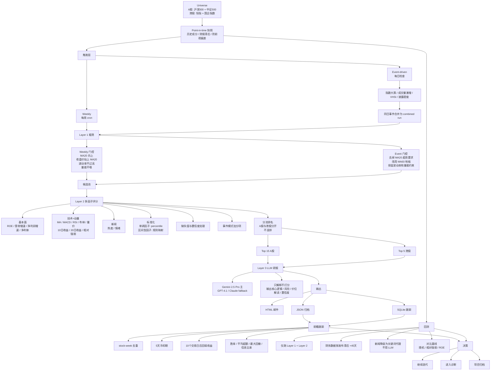
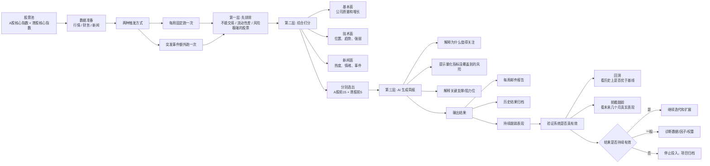

# Stock Screener

A-share + HK stock screening tool with multi-layer funnel, multi-factor scoring, LLM-assisted reports, and built-in validation framework.

## Architecture


```mermaid
flowchart TD
    A[Universe\nA股: 沪深300 + 中证500\n港股: 恒指 + 国企指数] --> B[Point-in-time 快照\n历史成分 / 财报滞后 / 防前视偏差]

    B --> C[触发层]
    C --> C1[Weekly\n每周 cron]
    C --> C2[Event-driven\n每日检查]
    C2 --> C3[指数大跌 / 成交量激增 / VHSI / 披露密度]
    C3 --> C4[同日事件合并为 combined run]

    C1 --> D[Layer 1 粗筛]
    C4 --> D

    D --> D1[Weekly 门控\nMA20 向上\n收盘价站上 MA20\n波动率不过高\n量能不塌]
    D --> D2[Event 门控\n去掉 MA20 趋势要求\n改用 MA60 地板\n保留波动率和量能约束]
    D1 --> E[候选池]
    D2 --> E[候选池]

    E --> F[Layer 2 多因子评分]
    F --> F1[基本面\nROE / 营收增速 / 净利润增速 / 净利率]
    F --> F2[技术+动量\nMA / MACD / RSI / 布林 / 量价\n10日收益 / 20日收益 / 相对强弱]
    F --> F3[新闻\n热度 / 情绪]
    F --> F4[标准化\n单调因子: percentile\n区间型因子: 规则映射]
    F --> F5[缺失值与置信度处理]
    F --> F6[事件模式加分项]

    F --> G[分池排名\nA股与港股分开\n不混排]
    G --> G1[Top 15 A股]
    G --> G2[Top 5 港股]

    G1 --> H[Layer 3 LLM 研报]
    G2 --> H
    H --> H1[Gemini 2.5 Pro 主\nGPT-4.1 / Claude fallback]
    H --> H2[只解释不打分\n输出核心逻辑 / 风险 / 价位解读 / 置信度]

    H --> I[输出]
    I --> I1[HTML 邮件]
    I --> I2[JSON 归档]
    I --> I3[SQLite 跟踪]

    I2 --> J[前瞻跟踪]
    I3 --> J
    J --> J1[stock-week 去重]
    J --> J2[5天冷却期]
    J --> J3[10个交易日后回填收益]
    J --> J4[胜率 / 平均超额 / 最大回撤 / 信息比率]

    B --> K[回测]
    K --> K1[仅跑 Layer 1 + Layer 2]
    K --> K2[财务数据按发布滞后 +45天]
    K --> K3[新闻降级为关键词代理\n不用 LLM]
    K --> K4[对比基线\n随机 / 相对强弱 / ROE]

    J --> L[决策]
    K --> L
    L --> L1[继续迭代]
    L --> L2[进入诊断]
    L --> L3[项目归档]
```

## Overview


```mermaid
flowchart LR
    A[股票池\nA股核心指数 + 港股核心指数] --> B[数据准备\n行情 / 财务 / 新闻]
    B --> C[两种触发方式]
    C --> C1[每周固定跑一次]
    C --> C2[突发事件额外跑一次]

    C1 --> D[第一层: 先排除\n不能交易 / 流动性差 / 风险极端的股票]
    C2 --> D

    D --> E[第二层: 综合打分]
    E --> E1[基本面\n公司质量和增长]
    E --> E2[技术面\n位置、趋势、强弱]
    E --> E3[新闻面\n热度、情绪、事件]

    E --> F[分别选出\nA股前15 + 港股前5]
    F --> G[第三层: AI 生成简报]
    G --> G1[解释为什么值得关注]
    G --> G2[提示量化指标没覆盖到的风险]
    G --> G3[解释关键支撑/阻力位]

    G --> H[输出结果]
    H --> H1[每周邮件报告]
    H --> H2[历史结果归档]
    H --> H3[持续跟踪表现]

    H3 --> I[验证系统是否真有效]
    I --> I1[回测\n看历史上是否优于基线]
    I --> I2[前瞻跟踪\n看未来几个月真实表现]

    I --> J{结果是否持续有效}
    J -->|是| K[继续迭代和扩展]
    J -->|一般| L[诊断数据/因子/权重]
    J -->|否| M[停止投入，项目归档]
```

## System Diagram (Text)

```
+----------------------------------------------------------------------------------+
|                             STOCK SCREENER SYSTEM                                |
+----------------------------------------------------------------------------------+

  [Universe]
    A股: 沪深300 + 中证500
    港股: 恒指 + 国企指数
          |
          v
  [Point-in-Time 快照层]
    - 历史成分快照
    - 财报发布滞后 +45天
    - 防前视偏差
          |
          v
  [触发层]
    +----------------------+----------------------+
    | Weekly               | Event-driven         |
    | 每周 cron            | 每日收盘后检查       |
    +----------------------+----------------------+
                               |
                               v
                        [事件触发器]
                        - 指数大跌
                        - 成交量激增
                        - VHSI 飙升
                        - 披露密度阈值
                               |
                               v
                        [同日多触发合并]
                        combined run / run_id

          |
          v
  [Layer 1 粗筛]
    +--------------------------------------------------------------+
    | Weekly 门控                                                  |
    | - MA20 向上                                                  |
    | - 收盘价 > MA20                                              |
    | - 波动率不过高                                               |
    | - 量能不塌                                                   |
    +--------------------------------------------------------------+
    | Event 门控                                                   |
    | - 去掉 MA20 趋势要求                                        |
    | - 改用 MA60 地板                                             |
    | - 波动率不过高                                               |
    | - 量能检查                                                   |
    +--------------------------------------------------------------+
          |
          v
  [候选池]
    约 200-400 只
          |
          v
  [Layer 2 多因子评分]
    1) 基本面
       - ROE
       - 营收增速
       - 净利润增速
       - 净利率

    2) 技术 + 动量
       - MA 排列
       - MACD
       - RSI
       - 布林带位置
       - 量价配合
       - 10日收益
       - 20日收益
       - 相对强弱

    3) 新闻
       - 热度
       - 情绪

    标准化:
       - 单调因子 -> percentile rank
       - 区间最优因子 -> 规则映射函数

    其它规则:
       - 缺失值重算权重
       - 低覆盖 -> 低置信度
       - 事件模式可加 bonus
          |
          v
  [分池排名]
    - A股单独排名
    - 港股单独排名
    - 不混排
          |
          v
  [Top N]
    - A股 Top 15
    - 港股 Top 5
          |
          v
  [Layer 3 LLM 研报]
    输入:
      - 三维得分
      - 因子值
      - 新闻标题
      - 规则计算价位
    模型链:
      Gemini 2.5 Pro
         -> GPT-4.1
         -> Claude
    输出:
      - 核心逻辑
      - 主要风险
      - 价位解读
      - 置信度
    注:
      LLM 只解释, 不参与打分
          |
          v
  [输出层]
    +-------------------+-------------------+----------------------+
    | HTML 邮件         | JSON 归档         | SQLite 跟踪          |
    | 周报 / 事件报告   | results/{run_id}  | recommendations      |
    | 迷你K线图         |                   | outcomes             |
    | 市场概览          |                   | run_summary          |
    +-------------------+-------------------+----------------------+
                                                   |
                                                   v
  [前瞻跟踪]
    - stock-week 去重
    - 5天冷却期
    - 10个交易日后回填收益
    - 标签: WIN / DRAW / LOSE
    - 指标:
      胜率 / 平均超额 / 最大回撤 / 信息比率
                                                   |
                                                   v
  [决策]
    - 继续迭代
    - 进入诊断
    - 项目归档


+----------------------------------------------------------------------------------+
|                                   BACKTEST                                       |
+----------------------------------------------------------------------------------+

  [历史 Universe 快照]
          +
  [Point-in-Time 财务]
          +
  [历史新闻代理(关键词, 不用 LLM)]
          |
          v
  [只运行 Layer 1 + Layer 2]
          |
          v
  [和基线对比]
    - 随机选股 20 只
    - 按相对强弱选 Top 20
    - 按 ROE 选 Top 20
          |
          v
  [评估]
    - 3个月: 验证管线跑通
    - 6-12个月: 初步判断信号质量
          |
          v
  [若持续跑不赢简单基线 -> 诊断 / 归档]
```

## Key Design Decisions

- **Independent repo** — no symlink/dependency on stock-monitor; lean data layer copied and slimmed down
- **A-share and HK ranked separately** — different liquidity, data sources, and trading accounts
- **Dual trigger mode** — weekly scheduled + event-driven (with separate Layer 1 gates per mode)
- **LLM explains, not scores** — Layer 3 generates reports but does not influence ranking
- **Point-in-time backtest** — fundamentals use +45d publication lag, news degrades to keyword proxy
- **Built-in stop conditions** — 12-period diagnosis gate, 24-period archive gate

## Tech Stack

- Python 3.12, `~/stock-env/` venv
- Data: East Money push2delay + akshare + Longbridge CLI (HK) + Tencent (fallback)
  - **Note (2026-06-03)**: push2 overseas edge nodes return 502 for this EC2 since 2026-06-02 (domestic access unaffected; push2delay serves byte-identical fields and is NOT blocked). Research snapshots use Tencent qt primary + push2delay fallback (`5c7167e`); Phase 0 fundamentals fetcher (`phase0_spike.py`) migrated push2 → push2delay.
- Technical analysis: pandas-ta
- LLM: GPT-4.1-mini (sentiment batch) + Gemini 2.5 Pro (reports) with fallback chain
- Storage: JSONL + SQLite
- Output: HTML email (MVP), Web UI (post-validation)

## Status

**Phase 0: DONE** (2026-04-17 full run, 885 stocks, all 6 §C criteria met). Next stage = "Layer 1 Weekly" (= M0 productionize + M1 Layer 1). Layer 1 design §0 (strategy posture) + §1 scope + §2 architecture v5 + §3 four Layer 1 rules v2 all frozen 2026-04-18; §4 (sector tagging + HK fallback) + §5 (error handling + resume) WIP.

**Strategy posture**: current Layer 1 4-rule set is right-side trend confirmation by design. User's true preference tilts left-side dislocation — deferred as M1.5 channel, merged in Layer 2 via `entry_pathway` tag.

**Daily API canary** (since 2026-04-25): `scripts/canary_check.sh` runs 10:00 BJT (`0 2 * * *` UTC) via `~/cron-wrapper.sh`, executes `phase0_spike.py --limit 15 --workers 1`, writes to `artifacts/canary-latest/`. Pass = universe == 15 + ohlcv ≥ 14 + fundamentals ≥ 14. Failure → email alert (threshold-check exit propagation fixed 2026-07-06, `aebb574` — a FAIL between 928026c and the fix exited 0 silently). Verifies akshare / Longbridge / East Money all healthy without daily-running the 74-min full pipeline. Will be re-evaluated once Layer 1 Weekly cron lands. **Fundamentals fetch retry (2026-07-13, `bdd26cc`)**: `fetch_fundamentals_one` hit transient push2delay 15s timeouts on 1-3/15 symbols three times in one week (7-05/7-08/7-13, each confirmed transient by manual replay) — added 2 retries with 2s/5s backoff on network-transient errors only. **CSI universe fetch retry (2026-07-20, `371eb5d`)**: `_fetch_csi_universe` (Step 1) died when the csindex.com.cn constituent API hung >30s — extracted `_fetch_csi_once` (30s fail-fast) and wrapped it in a retry loop (`CSI_RETRY_BACKOFFS=[5,15]`); verified live against a degraded upstream (attempts 1-2 both >30s, attempt 3 succeeded in ~94s total).

**Research stock snapshots** (since 2026-05-03): `scripts/update_research_snapshots.py` refreshes price / market cap / dynamic PE(PS) / technicals for stocks registered in `config/research_stocks.json`, publishing to docs.sinostor.com.cn research pages. Runs Mon–Fri 15:30 BJT via `cron-wrapper --name research-snapshots`. **Quote source (since 2026-06-03, `5c7167e`)**: Tencent qt.gtimg.cn primary + East Money push2delay fallback — push2 overseas edges started returning 502 on 2026-06-02 (verified server-side block: same request succeeds from a domestic IP); push2delay serves identical fields and remains reachable. STAR-board (688) volume comes back in shares, other boards in lots; the parser normalizes both to 万手. **Tests**: `tests/test_update_research_snapshots.py`, 16 unit tests with real captured qt fixtures.

**Short-history guard for recent listings (2026-08-03, `7f8b341`)**: metric computation was extracted into the pure function `compute_technicals(rows)` and every metric now yields `None` when its window is genuinely unavailable, instead of silently substituting a shorter one. Two defects motivated this: (a) `len(rows) < 60` raised outright, so registering 长鑫科技 688825 (listed 2026-07-27, only 6 bars) would have failed the whole daily cron — and with it the other 10 healthy stocks — every trading day for ~3 months; (b) with fewer than a year of bars the old code wrote a short-window return into `year_return_pct` regardless, so the live 智谱 02513 page (138 bars, listed 2026-01-08) labelled a 138-trading-day +629.7% as a *1-year* return. New fields (added, none removed): `history_days`, `period_return_pct`, `week52_is_full`. `ma20_slope` is now `None` rather than defaulting to `"down"` when the slope cannot be computed. **A full year is judged by calendar span (≥350 days), not bar count** — the fetch window is only the last 366 days and an A-share year measures ~241 bars in practice (中际旭创, measured 2026-08-03), so a 252-bar threshold would have misclassified every existing stock as history-deficient; this was caught by a live run, not by unit tests, and is now pinned by a regression test.

**Consensus estimate auto-refresh (2026-08-03, `7f8b341`)**: `scripts/update_research_consensus.py` fetches broker consensus from Tonghuashun (`ak.stock_profit_forecast_ths`) — one call yields revenue + net profit, three actual years plus three forecast years — and writes `docs-site/data/{key}-consensus.json`. Motivation: the `consensus` block in `config/research_stocks.json` is hand-maintained and, per `git log -S`, had never been updated since each stock was registered (旭创 2026-05-03, 寒武纪 2026-05-06, 茅台 2026-07-07), while the snapshot job refreshes market cap daily — so the published dynamic PE/PS meant "today's price ÷ a three-month-old estimate". The script **does not rewrite the registry**; the registry stays the human-authoritative source and auto-fetched values land in a separate file for review. Broker count, min, max and `spread_ratio` are stored alongside the mean, because the mean alone hides dispersion (旭创 2027E spans 2.35× between low and high across 31 brokers). HK is skipped explicitly — Tonghuashun does not cover it and the per-broker table available for HK has no consensus mean and no revenue line, so folding it into the same schema would imply a consistency that does not exist. East Money's `stock_profit_forecast_em` is unusable (its `RPT_WEB_RESPREDICT` report returns `result:null`). Supports `--dry-run` / `--symbol`; run time ~4 min for 10 stocks. **Tests**: `tests/test_update_research_consensus.py`, 24 unit tests over real captured THS fixtures. **Third-party cross-check (2026-08-03, `0eb3669`)**: a single source cannot be validated, and manual Wind checking does not scale. Each run now also pulls East Money's F10 endpoint `emweb.securities.eastmoney.com/PC_HSF10/ProfitForecast/PageAjax` — an independent collection pipeline that additionally supplies per-field broker counts, per-broker detail with publish dates, and a rating distribution. Every year/field pair is labelled `CONFIRMED` / `DIVERGENT` / `UNVERIFIED`; the last of these is deliberately distinct from the first, because silently treating "could not verify" as "verified" is the exact failure this feature exists to prevent. A cross-source failure only warns — primary data still lands, marked unverified. First full-pool run: 9/10 stocks fully CONFIRMED; the only divergence is 寒武纪 (2027E revenue -10.3%, 2028E profit -11.5%, 2028E revenue -10.8%). **Cron**: monthly on the 1st at 08:45 BJT (`45 0 1 * * `, timeout 900s) via `cron-wrapper --name research-consensus`, chained to `commit_research_data.sh "data/*-consensus.json"`. The 00:45 UTC slot sits clear of research-financials (00:15, ends ~00:21), research-peers (00:30, ends ~00:33) and gmia-profile-refresh (01:20). Wired 2026-08-03 at the user.s direction without waiting for third-party verification of the Tonghuashun basis — the accepted trade-off is to fix discrepancies as they surface rather than block the pipeline.

**Research data freshness health-check** (since 2026-06-04, `46f1119`): `scripts/research_data_health.py` scans the `docs-site/data` outputs of the research pipeline — snapshot (`as_of`), financials (`updated_at`), peers-market (`as_of`) — and emails an alert when any file is missing or stale beyond its threshold (snapshot/peers > 4 days, financials > 40 days). Closes the monitoring blind spot where an upstream fetch silently returns stale data yet exits 0. No LLM; runs daily 16:10 BJT via `cron-wrapper --name research-data-health`. Quarterly-financials revenue/profit are kept to 2-decimal precision (`38c7a91`) so the research pages can hydrate small-magnitude figures correctly. Both the annual-report PDF extractor and the `--with-pdf` peers fetcher route LLM extraction through the Claude Code Max Plan (`8be3d67`), dropping the Anthropic API key for zero metered cost.

### Design artifacts

- [Design spec](docs/superpowers/specs/2026-04-14-stock-screener-design.md) — ~800 lines, 5-round review, 6 findings fixed
- [Layer 1 Weekly design](docs/superpowers/specs/2026-04-18-layer1-weekly-design.md) — §0-§3 frozen, §4-§5 WIP
- [Phase 0 spike plan v3](docs/superpowers/plans/2026-04-15-phase0-data-spike.md) — §A–§I frozen, full run completed
- [Phase 0 infra plan](docs/superpowers/plans/2026-04-15-phase0-data-infra.md) — **SUPERSEDED**, do not reference for implementation

### Phase 0 scope

- **Universe**: CSI 300 + CSI 500 (A-share, ~800) + HSI + HSCEI (HK, ~100 provisional seed)
- **Data**: OHLCV via Longbridge CLI + fundamentals via East Money push2 — 8 canonical fields per §I (`roe_ttm`, `revenue_growth`, `net_profit_growth`, `net_margin_ttm`, `gross_margin`, `pe_ttm`, `pb`, `market_cap`); HK has known gaps on `revenue_growth` / `net_margin_ttm` / `gross_margin`
- **Output**: `artifacts/phase0/` (production `data/` reserved for Phase 1+)
- **Dry-run**: 15 frozen samples (10 A-share + 5 HK), verified against live index membership 2026-04-16
- **Exit criteria**: classifiable + reproducible + recoverable failures, NOT coverage %
